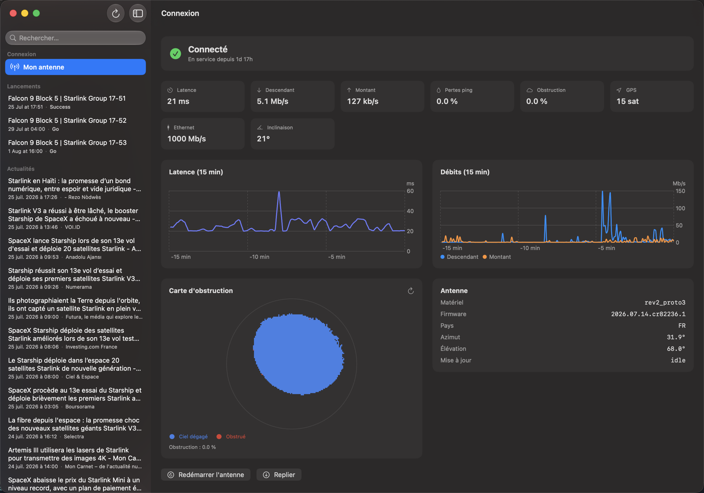
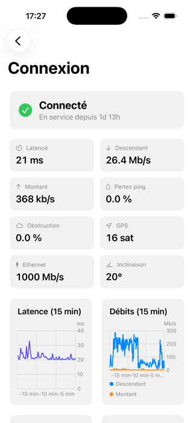
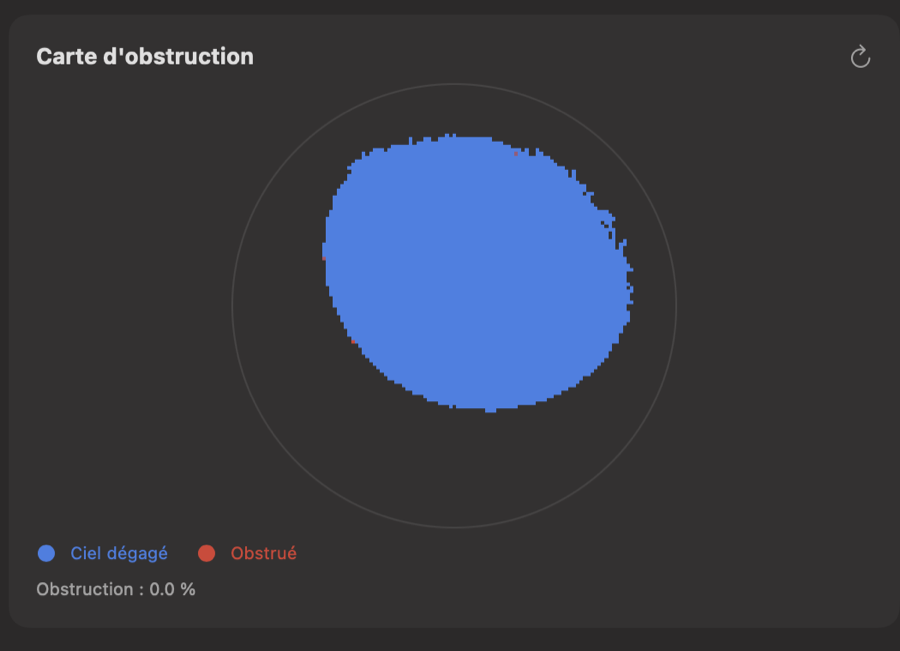

<div align="center">

# StarlinkInfos

**A native macOS &amp; iOS app that talks directly to your Starlink dish.**

Real-time status, latency &amp; throughput history, obstruction map, and one-click
reboot/stow — straight from the dish's own local API. Plus Starlink news, upcoming
launches and constellation stats on the side.

[](https://www.apple.com/macos)
[](https://github.com/vincentlauriat/StarlinkInfos/releases/latest)
[](https://swift.org)
[](LICENSE)

<br/>

*No cloud · no account · no API key — the app just reads what your dish already knows*

<br/>

**[✨ See the landing page](https://vincentlauriat.github.io/StarlinkInfos/)**

<br/>

| Dashboard | iOS | Obstruction map |
|:---------:|:---:|:----------------:|
|  |  |  |
| Status, latency &amp; throughput charts, dish info and controls | The same live dashboard, checked from your phone | The dish's own sky-view SNR grid |

</div>

---

## Features

| | |
| --- | --- |
| 📡 **Real-time dashboard** | Connection status, uptime, latency, throughput, GPS lock, Ethernet speed, dish tilt — polled live from the dish itself |
| 📈 **Latency &amp; throughput charts** | Last 15 minutes of ping and download/upload speed, from the dish's own history buffer |
| 🛰️ **Obstruction map** | The exact sky-view SNR grid the dish uses to detect obstructions |
| 🔁 **Dish controls** | Reboot or stow/unstow, always behind a confirmation |
| 📰 **Starlink news** | Google News RSS feed, follows the app's language (fr/en) |
| 🚀 **Launches &amp; constellation** | Upcoming Starlink launches with a countdown, plus a live satellite-in-orbit count (Celestrak) |
| ⚙️ **Settings** | Appearance (system/light/dark), language (system/fr/en) |
| 🔄 **Auto-update** | Signed, notarized, self-updating via Sparkle |

The dish API (`192.168.100.1:9200`, gRPC) is local and unauthenticated — the
dashboard only works while connected to the Starlink network.

## Install

Grab the latest `.dmg` from the
[Releases page](https://github.com/vincentlauriat/StarlinkInfos/releases/latest),
mount it, and drag `StarlinkInfos.app` to `/Applications`.

**Requirements:** macOS 15 or later (iOS 18+ for the shared iOS target).

Releases are signed with an Apple Developer ID, built with the Hardened Runtime, and
notarized by Apple — they open without any Gatekeeper warning.

## Build from source

**Requirements:** Xcode 16+, [XcodeGen](https://github.com/yonaskolb/XcodeGen).

```bash
brew install xcodegen
git clone https://github.com/vincentlauriat/StarlinkInfos.git
cd StarlinkInfos
xcodegen generate            # generates StarlinkInfos.xcodeproj
open StarlinkInfos.xcodeproj # macOS: scheme StarlinkInfos — iOS: scheme StarlinkInfosiOS
```

To regenerate the gRPC client after a dish firmware update, see `ARCHITECTURE.md`
(section "The dish gRPC API").

## Tests

```bash
xcodebuild -project StarlinkInfos.xcodeproj -scheme StarlinkInfos -configuration Debug \
  CODE_SIGNING_ALLOWED=NO test
```

## Release (macOS)

```bash
./Scripts/release.sh 1.1.0   # build → sign → DMG → notarize → staple → Sparkle-sign
```

## Project layout

```
StarlinkInfos/
├── StarlinkInfosApp.swift       # @main
├── Models/                      # DishModels (status/history/map), FeedModels (news/launches)
├── ViewModels/                  # DishViewModel (2 s polling), FeedViewModel
├── Views/
│   ├── ContentView.swift        # NavigationSplitView, sidebar with 3 sections
│   └── Dashboard/               # dashboard, charts, obstruction map, controls
├── Services/                    # DishClient (gRPC actor), NewsService, LaunchService, ConstellationService
├── Generated/                   # protoc output from Proto/dish.protoset — do not edit
└── Localization/                # AppSettings + fr/en string table
StarlinkInfosTests/               # unit tests: history ring-buffer mapping, RSS parser
Proto/dish.protoset               # dish API descriptor set (dumped via gRPC reflection)
docs/                             # GitHub Pages landing page
Scripts/                          # release.sh, make-starlink-icon.swift, make-dmg-background.swift
project.yml                       # XcodeGen config (targets + SPM packages)
```

See [ARCHITECTURE.md](ARCHITECTURE.md) for the full design — how the dish's gRPC API
is wired up, and how to regenerate the client after a firmware update.

## License

MIT © 2026 Vincent Lauriat — see [LICENSE](LICENSE).
